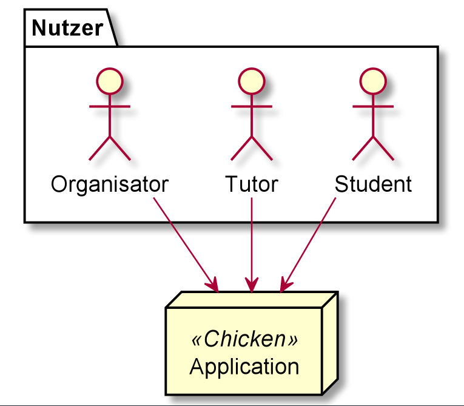
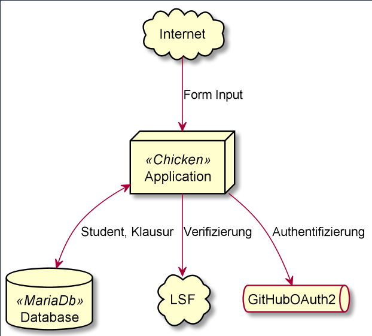

[[section-system-scope-and-context]]
== Kontextabgrenzung

=== Fachlicher Kontext

* Studenten
** können global im System Klausuren eintragen
** sind in der Lage sich für Klausuren anzumelden und die Anmeldung zu stornieren
** dürfen sich für Urlaubstermine anmelden
** können ihre angemeldeten Urlaubstermine und Klausuren einsehen

* Organisatoren
** -

* Tutoren
** -

=== Technischer Kontext

* Internet
** über das Internet werden die Formulardaten für die jeweiligen Anwendungsfälle entgegengenommen

* GitHubOAuth2
** authentifiziert die Nutzer

* Datenbank
** persistiert die Aggregate Student und Klausur

* LSF
** wird zur Verifizierung der Veranstaltungs-ID verwendet
