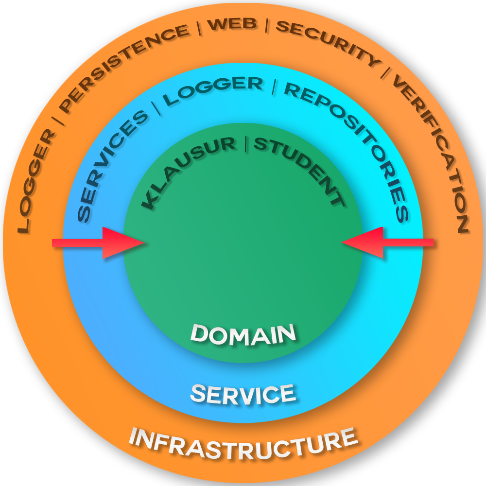

[[section-solution-strategy]]
== Lösungsstrategie

=== Onion-Architektur

* Aufbau
** Domäne
*** Zwei Aggregate (Student und Klausur)
*** Klausuren haben eine Klausurart (Online oder Präsenz), eine VeranstaltungsId und den jeweiligen Klausurzeitraum
*** Klausuren können separat angelegt werden
*** Student speichert Referenzen auf die angemeldeten Klausuren und Urlaubstermine
** Service
*** Klausurservice und Studentservice
*** Klausurservice ist für die Verwaltung von Klausuren zuständig (Global anlegen, laden)
*** Studentenservice ist für die Anmeldung und Stornierung von Urlaubs- und Klausurterminen für einen jeweiligen Studenten zuständig.
** Infrastructure
**** Drei Adapter (Logger, Persistence und Web)
**** Logger ist für das Loggen der Urlaubsterminanmeldungen und Stornierungen zuständig
**** Persistence managed den Datenbankzugriff mithilfe von Spring Data JDBC
**** Web bietet mithilfe von Spring Web und Spring Security eine Web-Schnittstelle für die Anwendung an (Controller + Frontend)
** Configuration
*** Außerhalb der Schichtenarchitektur gibt es einen weiteren "Adapter", welcher für die Konfiguration der Start- und Enduhrzeiten des Praktikums zuständig ist

