[[section-building-block-view]]
== Bausteinsicht

=== Whitebox Gesamtsystem

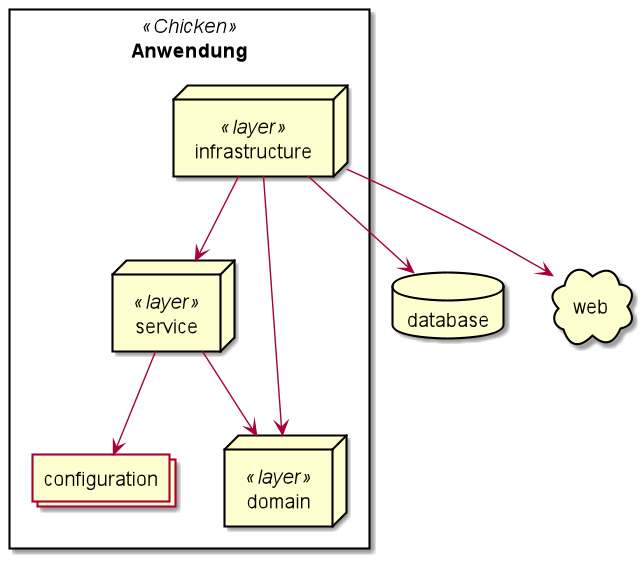

Eine Übersicht über die in den Lösungsstrategien beschriebene Onion-Architektur

==== Domain

===== Überblick

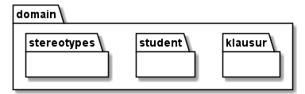

* Stereotypes
** In der Domäne benutzte Annotationen (AggregateRoot und ValueObject), welche für bestimmte ArchUnit-Regeln verwendet werden.

* Student
** Student Aggregat, in welchem die Urlaubstermine eines Studenten und Referenzen auf die angemeldeten Klausuren verwaltet werden.
** Die Github-ID ist hier das identitätsstiftende Attribut und das Github-Handle wird zusätzlich gespeichert, da es variabel ist.

* Klausur
** Klausur Aggregat, welches eine im System angelegte Klausur beschreibt.

===== Klausur Aggregat

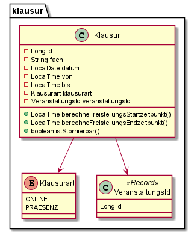

* Klausur
** Aggregate Root der Klausur, mit welchem sich die Freistellungszeiträume berechnen lassen.
* Klausurart
** Stellt die Art der Klausur dar (Online oder Präsenz). Dient zur Berechnung der Freistellungszeiträume.
* VeranstaltungsId
** Die ID der Veranstaltung aus dem LSF.

===== Student Aggregat

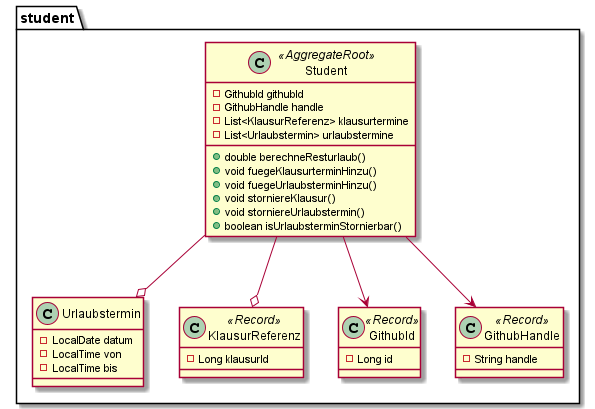

* Student
** Aggregate Root des Studenten, welche die Logik für die Urlaubs- und Klausurverwaltung enthält.
* Urlaubstermin
** Stellt einen einzigen Urlaubstermin dar (z. B. Urlaub am Freitag von 9:30 bis 10:30 Uhr).
* KlausurReferenz
** Dient als Referenz auf das Klausuraggregat. Stellt dabei eine angemeldete Klausur dar.
* GithubId
** Die Github-ID des Studenten, über welche man einen Studenten eindeutig identifizieren kann (auch bei Änderungen des Handles).
* GithubHandle
** Der momentane Github-Handle des Studenten.

==== Service

===== Überblick

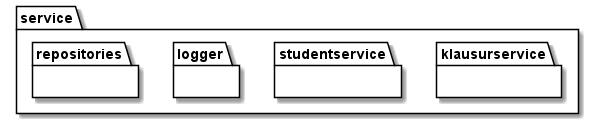

* Repositories
** Die Interfaces, welche in der Infrastruktur-Schicht implementiert werden, und für den Datenbankzugriff zuständig sind.
* Logger
** Die Interfaces, welche in der Infrastruktur-Schicht implementiert werden, und für das Loggen der Urlaubsterminanmeldungen und Stornierungen zuständig sind.
* Studentservice
** Bietet Methoden an, um Urlaubstermine und Klausuren eines Studenten zu verwalten. Übernimmt außerdem die Logik dafür, dass der Urlaub anpasst wird, wenn man in dem Zeitraum des Urlaubstermins bereits für Klausuren angemeldet ist.
* Klausurservice
** Bietet Methoden für das Eintragen einer Klausur und das Laden bestimmter Klausuren im System an.

===== Whitebox der Serviceschicht

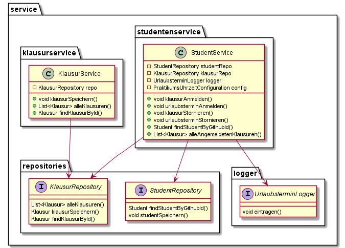

==== Infrastructure

===== Überblick

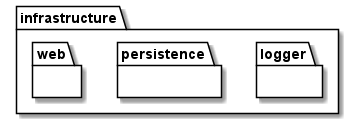

* Web
** Implementierung der Web-Schnittstelle der Anwendung. (Spring Web + Thymeleaf)
* Persistence
** Adapter für die Datenbankanbindung. (Spring Data JDBC)
* Logger
** Adapter für das Loggen der Urlaubstermine. (schreibt das Log in eine lokale Textdatei)

===== Web

====== Controller

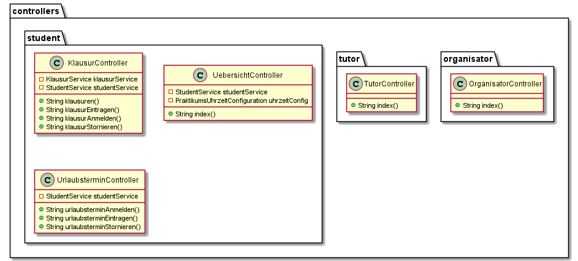

* Student
** UebersichtController
*** Hier wird die Übersichtsseite für den Studenten ausgeliefert, indem der Student und die angemeldeten Klausuren aus dem jeweiligen Service geladen und dem Model übergeben werden.
** KlausurController
*** Bietet Routen für die Eintragung, Anmeldung und Stornierung von Klausuren.
** UrlaubsterminController
*** Bietet Routen für die Anmeldung und Stornierung von Urlaubsterminen.

====== Forms

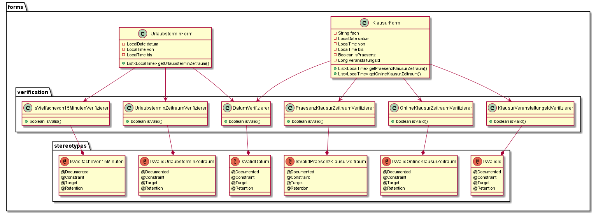

* UrlaubsterminForm
** Datencontainer für den Forminput eines Urlaubstermins.
** Hier wird verifiziert, ob die Daten gültig sind.
*** 15 Minuten Takt des Urlaubs
*** End- liegt nach Startuhrzeit
*** Liegt innerhalb des Praktikumszeitraums

* KlausurForm
** Datencontainer für den Forminput einer Klausur.
** Hier wird verifiziert, ob die Daten gültig sind.
*** End- liegt nach Startuhrzeit
*** Liegt innerhalb des Praktikumszeitraums
*** VeranstaltungsId ist gültig <--> Veranstaltung ist im LSF vorhanden

* Annotations
** Hier liegen die Annotationen für die Verifizierung der Daten.
** Dafür werden eigene Spring Validation Annotationen verwendet.
* Verification
** Logik für die Verifizierung der Daten.

====== Configuration

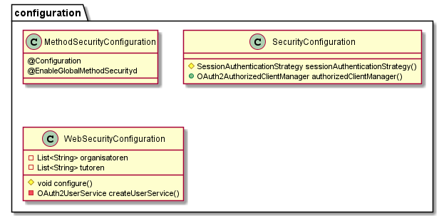

Hier wird Spring Security konfiguriert. Dabei gibt es eine strikte Rollenzuteilung -> siehe Entwurfsentscheidungen

===== Persistence

image:../images/infrastructure-whitebox-persistence.png[Fachlicher Kontext]

* DTO
** Datencontainer für das Speichern und Laden der jeweiligen Aggregate.
* DAO
** Verwendet CrudRepositorys zum Speichern der Aggregate (Spring Data JDBC).
* StudentRepositoryImpl
** Implementierung des Repositorys aus der Serviceschicht, mithilfe des StudentDto DAOs.
* KlausurRepositoryImpl
** Implementierung des Repositorys aus der Serviceschicht, mithilfe des KlausurDto DAOs.

===== Logger

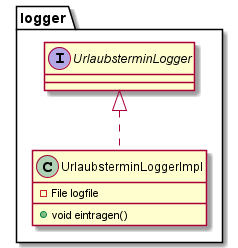

* UrlaubsterminLoggerImpl
** Bietet eine Methode, um eine Nachricht in der lokalen Logdatei einzutragen.
** Speichert dabei das Datum und die Uhrzeit zu der die Nachricht geloggt wird.